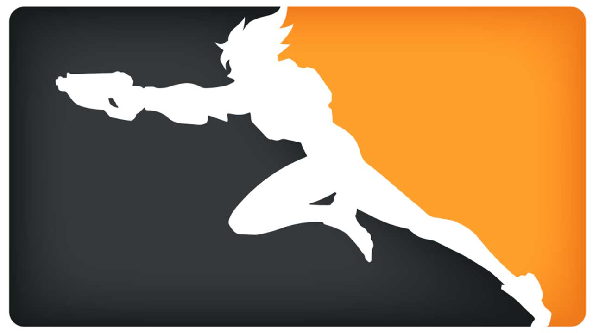

<p align=center>

  </p>

# Overwatch League API Documentation 
An unofficial analysis of the Overwatch League API V2.

# Disclaimer
The Overwatch League API is not officially supported by Blizzard, and is subject to change at any time. The documentation for the API is  developed by the community, and may or may not be complete. [Use at your own risk](https://i.imgur.com/Yr6WHNn.png).

# Getting Started
The Overwatch League is on a mission to celebrate fans and afford them opportunities to become champions through a professional esports ecosystem that embraces passion and rewards excellence. This API enables developers to have real time information about teams, players, match updates, and much more!

### The API is a RESTful Resource
Overwatch League API endpoints conform to the design principles of Representational State Transfer (REST). This API uses the JSON data format for responses.

### The API is HTTP-based over SSL
A GET request is required to retrieve data from the Overwatch League API.
Methods that submit, change or destroy data require a POST. A DELETE request is also accepted for methods that destroy data. API methods that require a particular HTTP method will return an error if not invoked using the correct endpoint or style. 

# Root URL
You can access the base API here at 
https://api.overwatchleague.com (China: https://api.overwatchleague.cn). Upon entering you'll see the following easter egg:

```
GET /

{
    "the world": "could always use more heroes"
}
```

# API Endpoints Overview
Here are the endpoints used to access Overwatch League's information such as player information, match updates, league standings, news reports, and much more. This document will be going over these objects in more detail.

```
GET /login
GET /auth/bnet/callback?code={code}
GET /user
GET /user/favorites
GET /v2/teams
GET /v2/teams/{id}
GET /ranking
GET /standings
GET /players
GET /players/{id}
GET /matches
GET /matches/{id}
GET /live-match
GET /schedule
GET /streams
GET /vods
GET /maps
GET /news
GET /playlist/owl-app-playlist
GET /about

POST /user/favorites
POST /user/favorites/order

DELETE /user/favorites/{id}
```
# API Endpoint Guides
Here this guide will go over in detail each use of the above endpoints/

## Authentication Endpoints
The following endpoints involve authenticating a Battle.net account, and authorizatino code use: 
### GET /login
* Redirects clients to the Battle.net login page. 
* **NOTE**: This may direct you to a page that cannot be opened by your browser if you are already logged into your Battle.net account.
  
### GET /auth/bnet/callback?code={code}
* Callback 
* `code` Battle.net authorization code

## User Endpoints
The following endpoints retrieve user information.

<!-- GET /login</br>
GET /auth/bnet/callback?code={code}</br>
GET /user</br>
GET /user/favorites</br>
GET /v2/teams</br>
GET /v2/teams/{id}</br>
GET /ranking</br>
GET /standings</br>
GET /players</br>
GET /players/{id}</br>
GET /matches</br>
GET /matches/{id}</br>
GET /live-match</br>
GET /schedule</br>
GET /streams</br>
GET /vods</br>
GET /maps</br>
GET /news</br>
GET /playlist/owl-app-playlist</br>
GET /about

POST /user/favorites</br>
POST /user/favorites/order

DELETE /user/favorites/{id} -->


| Team                   | ID   |
|:---------------------- |:----:|
|  Atlanta Reign | 7698 |
|  Boston Uprising  | 4402 |
|  Chengdu Hunters  | 7692 | 
|  Dallas Fuel | 4523 |
|  Florida Mayhem   | 4407 |
|  Guangzhou Charge | 7699 |
|  Hangzhou Spark   | 7693 |
|  Houston Outlaws | 4525 |
|  London Spitfire | 4410 |
|  Los Angeles Gladiators | 4406 |
|  Los Angleles Valiant | 4405 |
|  New York Excelsior | 4403 |
|  Paris Eternal | 7694 |
|  Philadelphia Fusion | 4524 |
|  San Francisco Shock | 4404 |
|  Seoul Dynasty | 4409 |
|  Shanghai Dragons | 4408 |
|  Toronto Defiant | 7695 |
|  Vancouver Titans | 7696 |
|  Washington Justice | 7697 |


