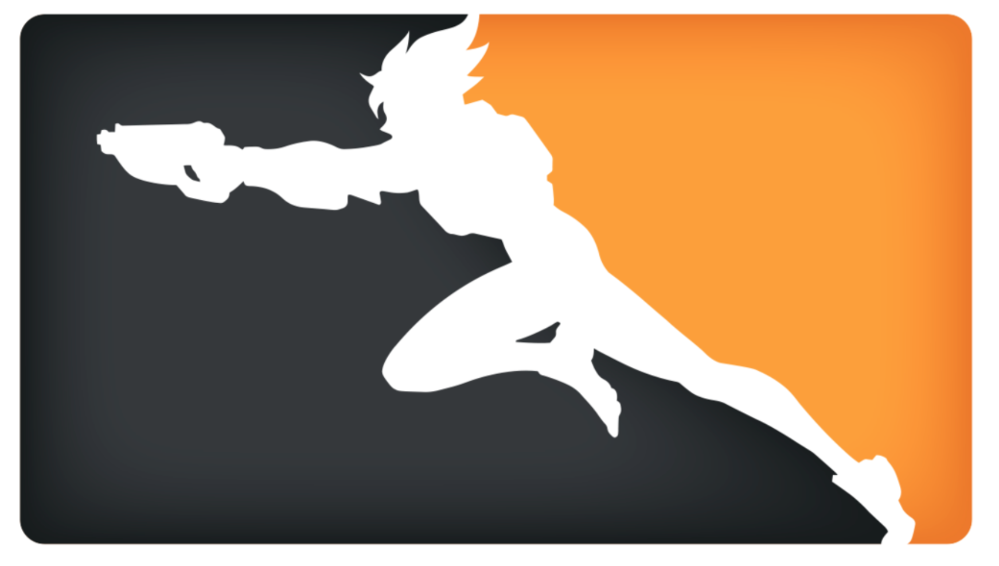

<p align=center>

  </p>

 <h1 align=center> Overwatch League API Documentation </h1>
<p align=center>An unofficial analysis of the Overwatch League API.</p>

# Disclaimer
The Overwatch League API is not officially supported by Blizzard, and is subject to change at any time. The documentation for the API is  developed by the community, and may or may not be complete. [Use at your own risk](https://i.imgur.com/Yr6WHNn.png).

# Getting Started
The Overwatch League is on a mission to celebrate fans and afford them opportunities to become champions through a professional esports ecosystem that embraces passion and rewards excellence. This API enables developers to have real time information about teams, players, match updates, and much more!

### The API is a RESTful Resource
Overwatch League API endpoints conform to the design principles of Representational State Transfer (REST). This API uses the JSON data format for responses.

### The API is HTTP-based over SSL
A GET request is required to retrieve data from the Overwatch League API.
Methods that submit, change or destroy data require a POST. A DELETE request is also accepted for methods that destroy data. API methods that require a particular HTTP method will return an error if not invoked using the correct endpoint or style. 

# Root URL
You can access the base API here at 
https://api.overwatchleague.com (China: https://api.overwatchleague.cn). Upon entering you'll see the following easter egg:

```
GET /

{
    "the world": "could always use more heroes"
}
```

# API Endpoints Overview
Here are the endpoints used to access Overwatch League's information such as player information, match updates, league standings, news reports, and much more. This document will be going over these objects in more detail.

```
GET /login
GET /auth/bnet/callback?code={code}
GET /user
GET /user/favorites
GET /v2/teams
GET /v2/teams/{id}
GET /ranking
GET /standings
GET /players
GET /players/{id}
GET /matches
GET /matches/{id}
GET /live-match
GET /schedule
GET /streams
GET /vods
GET /maps
GET /news
GET /playlist/owl-app-playlist
GET /about

POST /user/favorites
POST /user/favorites/order

DELETE /user/favorites/{id}
```

## Endpoint Locales
Reponses can be returned in several locales (a language and region identidier). The data will then be returned in the specified language.
* Locales
  * `de_DE` - German
  * `en_US` - English (United States)
  * `en_GB` - English (Great Britain)
  * `es_ES` - Spanish (Spain)
  * `es_MX` - Spanish (Mexico)
  * `fr_FR` - French
  * `it_IT` - Italian
  * `pt_BR` - Portuguese
  * `pl_PL` - Polish
  * `ru_RU` - Russian
  * `ko_KR` - Korean
  * `ja_JP` - Japanese
  * `zh_TW` - Chinese (Taiwan)
  * `zh_CH` - Chinese (China)
    * It is recommended to use the root URL for China listed above.
# API Endpoint Guides
Here this guide will go over in detail each use of the above endpoints.

## Authentication Endpoints
The following endpoints involve authenticating a Battle.net account, and authorizatino code use: 
### GET /login
* Redirects clients to the Battle.net login page. 
* **NOTE**: This may direct you to a page that cannot be opened by your browser if you are already logged into your Battle.net account.
  
### GET /auth/bnet/callback?code={code}
* Callback 
* `code` - Battle.net authorization code

## User Endpoints
The following endpoints retrieve user information.

### GET /user
* Returns Uaer info. Token required.

### GET /user/favorites
* Returns the User's favorite Overwatch League Teams. 

### POST /user/favorites
* Adds an Overwatch League Team to a User's Favorite Teams collection.
```
POST /user/favorites
{
  "id" : "4525",
  "tags" : [
    "owl"
  ],
  "franchise" : "overwatch"
}
```
### POST /user/favorites/order
* Updates the order of the User's favorite teams.
```
POST /user/favorites/order
{
    "ids": [
        "4525"
    ]
}
```

### DELETE /user/favorites/{id}
Deletes a favorite team from a User.

## Team Endpoints
The following endpoints retrieve information for Overwatch League Teams. 

### <a name="team-ids">Team IDs</a>
Each Overwatch League Team has a unique integer identifier (ID) which can be found upon visiting each team page on https://overwatchleague.com. For example, at the end of this URL is the ID for [Atlanta Reign](https://overwatchleague.com/en-us/teams/7698):

`https://overwatchleague.com/en-us/teams/7698`

We see that Atlanta Reign's ID following `/teams/` is `7698`. We can use this to retrieve information about Atlanta Reign's players, statistics, and more.

Below is a table of all team IDs for retrieving information for specific teams: 

| Team                   | ID   |
|:---------------------- |:-----|
|  Atlanta Reign | 7698 |
|  Boston Uprising  | 4402 |
|  Chengdu Hunters  | 7692 | 
|  Dallas Fuel | 4523 |
|  Florida Mayhem   | 4407 |
|  Guangzhou Charge | 7699 |
|  Hangzhou Spark   | 7693 |
|  Houston Outlaws | 4525 |
|  London Spitfire | 4410 |
|  Los Angeles Gladiators | 4406 |
|  Los Angleles Valiant | 4405 |
|  New York Excelsior | 4403 |
|  Paris Eternal | 7694 |
|  Philadelphia Fusion | 4524 |
|  San Francisco Shock | 4404 |
|  Seoul Dynasty | 4409 |
|  Shanghai Dragons | 4408 |
|  Toronto Defiant | 7695 |
|  Vancouver Titans | 7696 |
|  Washington Justice | 7697 |


### GET /v2/teams
Returns all competing Overwatch League teams.

#### Teams Data Dictionary 
Below you'll find the data dictionary for a Teams request. Some JSON examples will be omitted and covered in depth in later sections.

| Attribute           | Type  | Description |
|:--------------------|:------|:------------|
|`id`                   | Int64 | The unique integer for this League season. Example: <br><br><pre lang="json">"id": 61</pre>
|`availableLanguages`   |Array of String| Indicates a list of country and language codes. Example:<br><br><pre lang="json">"availableLanguages": ["en", "en-gb", "es-mx", "es-es", "pt", "de", "fr", "it", "pl", "ru", "ja", "ko", "zh-tw", "zh-cn"]</pre><i>Languages: Engish, English (Great Britian), Spanish (Mexico), Spanish (Spain), Portuguese, German, French, Italian, Polish, Russian, Japanese, Korean, Chinese (Taiwan), Chinease (China)</i><br><br>
|`name`               |  String| The name of the League. Example:<br><br><pre lang="json">"name": "The Overwatch League"</pre>
|`description`         | String | A summary of the Overwatch League. Example: <br><br><pre lang="json">"description": "The Overwatch League is on a mission to celebrate fans and afford them opportunities to become champions through a professional esports ecosystem that embraces passion and rewards excellence."</pre>
|`competitors`          | Array of [Competitor](objects/Competitor.md) Object | Competitors are Overwatch League Teams competing in the current Overwatch League Season. Additionally, see Competitor Object for more info.
|`game`                 | String | The String representation of the game being played. Example: <br><br><pre lang="json">"game": "OVERWATCH"</pre> |
|`logo`  | String | A URL leading to the Overwatch League Logo. Example: <br><br><pre lang="json">"logo": "https://bnetcmsus-a.akamaihd.net/cms/page_media/JEUWQ6CN33BR1507857496436.svg"</pre>
|`competitorType` | String| Describes the type of Competitors competing in the Overwatch League. Example:<br><br><pre lang="json">"competitorType": "TEAM"</pre>
| `owl_division` | Array of Division Object | The Divisions making up the Overwatch League. Example:<br><br><pre lang="json">owl_divisions": [<br>&thinsp;{<br>&emsp;&emsp;&emsp;"id": "79",<br>&emsp;&emsp;&emsp;"string": "owl.teams.divisions.atlantic",<br>&emsp;&emsp;&emsp;"name": "Atlantic Division",<br>&emsp;&emsp;&emsp;"abbrev": "ATL"<br>&thinsp;},<br>&thinsp;{<br>&emsp;&emsp;&emsp;"id": "80",<br>&emsp;&emsp;&emsp;"string": "owl.teams.divisions.pacific",<br>&emsp;&emsp;&emsp;"name": "Pacific Division",<br>&emsp;&emsp;&emsp;"abbrev": "PAC"<br>&thinsp;}<br>]</pre>

### GET /v2/teams/{id}
Returns information for a single Overwatch League Team given a [Team ID](#team-ids). For exmaple, to retrieve information about Boston Uprising we can add Boston Uprising's ID at the end of the URL:

`https://api.overwatchleague.com/v2/teams/4402`
### Team Data Dictionary 
Below you'll find the data dictionary for a Team request. Some JSON examples will be omitted and covered in depth in later sections.

| Attribute           | Type  | Description |
|:--------------------|:------|:------------|
|`id`                   | Int64 | The unique integer identifier for the Overwatch League Team. Example: <br><br><pre lang="json">"id": 4523</pre>
|`divisionId` | Int64 | The unique integer identifier for the Team's Overwatch League [Division](objects/Division.md). Example:<br><br><pre lang="json">"divisionId": 80</pre>
|`handle` | String | A String representation of an Overwatch League team's handle. Example: <br><br><pre lang="json">"handle": "fuel.6990"</pre>
|`name` | String | A String representation of an Overwatch League team's name. Example: <br><br><pre lang="json">"name": "Boston Uprising"</pre>
|`abbreviatedName` | String | A String representation of an Overwatch League team's 3 letter abbreviated name. Example: <br><br><pre lang="json">"abbreviatedName": "ATL"</pre>
| `logo` | [Logo](objects/Logo.md) Object | A Logo object containing an Overwatch League team's logo in SVG and PNG formats.|
|`hasFallback` | Boolean | Indicates whether or not a team has media queries which specific browsers cannot handle, such as logo files and headshot files. Example: <br><br><pre lang="json">"hasFallback": false</pre>
|`location` | String | A String representation of an Overwatch League team's base location. Example: <br><br><pre lang="json">"location": "Boston, MA"</pre>
| `players` | Array of [Player](objects/Player.md) Object |A Player roster for a competing Overwatch League Team. Additionally, see Player object for more info. |
|`website` | String | A String representation of an Overwatch League team's website url. Example: <br><br><pre lang="json">"website": "https://fuel.overwatchleague.com"</pre>
|`placement` | Int64 | The current standing of an Overwatch League Team. Example: <br><br><pre lang="json">"placement": 1</pre>
|`advantage` | Int64 | An integer indicating the advantage an Overwatch League Team has over its competitors. Example: <br><br><pre lang="json">"advantage": 0</pre>
| `records` | [Records](objects/Records.md) Object | A Records object containing an Overwatch League team's league records. See Records object for more info.|

### GET /ranking
Returns current rankings of all competing Overwatch League teams.